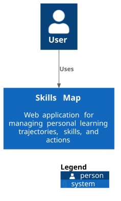
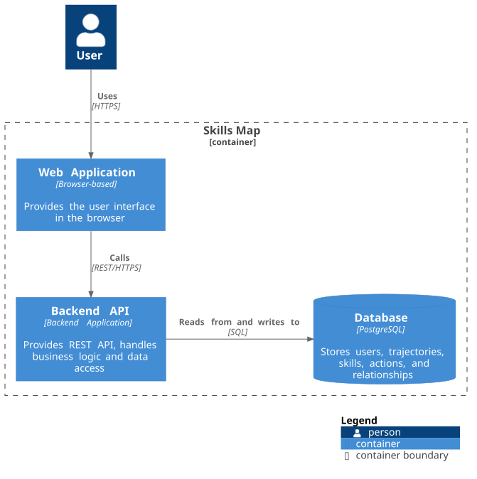

# Architecture
This section contains the high-level architecture of the Skills Map application based on the C4 model.
## C4 Context Diagram
This diagram shows the system boundaries, the primary actor, and external interactions.  

### PlantUML source
See [context-diagram.puml](./context-diagram.puml)
## C4 Container Diagram
This diagram shows the main containers of the application and the relationships between them.

### PlantUML source
See [container-diagram.puml](./container-diagram.puml)
