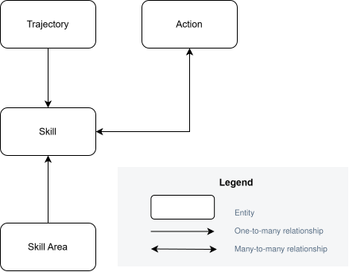

# Data Model
This section contains the data model design for the Skills Map application.
## Conceptual Data Model
Shows the main business entities and their relationships.  

## Logical Data Model
Shows entities, attributes, keys, and relationships.  
See [Logical Data Model](./logical-data-model.pdf).
## Data Dictionary
Contains descriptions of entities, attributes, and business rules.  
See [Data Dictionary](./data-dictionary.xlsx).
## PostgreSQL Schema
> The PostgreSQL schema will be added during the implementation phase.
