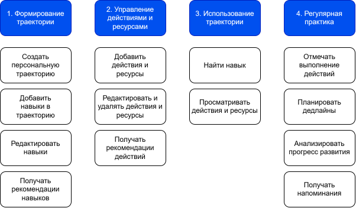

# User Stories
## Contents
- [Document Purpose](#document-purpose)
- [User Story Map](#user-story-map)
- [Epics](#epics)
- [User Story Backlog](#user-story-backlog)
- [MVP Scope](#mvp-scope)
## Document Purpose
Документ описывает пользовательские сценарии и приоритеты MVP на основе User Story Map.
## User Story Map
Цель пользователя (верхний уровень) - системно развивать навыки в выбранной сфере, сохраняя фокус и учитывая ограничения по времени.  

## Epics
Этапы User Journey и их ценность.  
- *Управление траекторией*: пользователь может осознанно спланировать свое развитие и выстроить понятную структуру навыков вместо хаотичных попыток обучения.
- *Управление действиями и ресурсами*: пользователь экономит время и когнитивные ресурсы, сохраняя проверенные материалы и шаги в одном месте.
- *Использование траектории*: пользователь быстро ориентируется в своей карте развития и понимает, что именно делать дальше для развития конкретного навыка.
- *Регулярная практика*: пользователь поддерживает устойчивый прогресс за счет фиксации выполненных действий и ощущения движения вперед, даже при высокой занятости.
## User Story Backlog
Приоритизация User Stories по методике MoSCoW:
- M (Must) — ядро Skills Map;
- S (Should) – улучшает или расширяет функциональность MVP;
- C (Could) – желательные функции, не критичные для MVP;
- W (Won't) – запланировано вне текущего релиза.

*Правило нумерации*: идентификаторы US0x относятся к пользовательским историям роли «Пользователь», идентификаторы US1x — к пользовательским историям роли «Наставник».

### Epic 1. Управление траекторией
- **US01. Создание траектории** – Как пользователь я хочу создавать персональную траекторию развития навыков в выбранной сфере, чтобы планировать и развивать навыки. **Priority:** M  
- **US04. Управление навыком** – Как пользователь я хочу добавлять и редактировать навыки, чтобы поддерживать свою карту развития в актуальном состоянии. **Priority:** M  
- **US08. Рекомендации навыков** – Как пользователь я хочу получать рекомендации по развитию навыков в выбранной сфере, чтобы дополнять свою траекторию актуальными и релевантными навыками и действиями по их развитию. **Priority:** W
### Epic 2. Управление действиями и ресурсами
- **US05. Добавление действия и ресурса** – Как пользователь я хочу привязывать к навыку проверенные курсы, материалы и задачи, чтобы не тратить время на повторный поиск информации. **Priority:** M  
- **US07. Удаление действия и ресурса** – Как пользователь я хочу удалять нерелевантные ресурсы и шаги, чтобы моя траектория развития оставалась сфокусированной и полезной. **Priority:** S
### Epic 3.	Использование траектории
- **US02. Поиск навыка** – Как пользователь я хочу быстро находить нужный навык, чтобы видеть связанные с ним действия и ресурсы для тренировки. **Priority:** M  
- **US06. Просмотр действий навыка** – Как пользователь с ограниченным временем я хочу видеть список действий по навыку, чтобы заниматься развитием даже при высокой занятости. **Priority:** M
### Epic 4. Регулярная практика
- **US011. Отметка статуса действия** – Как пользователь я хочу отмечать выполнение действия по навыку, чтобы понимать его текущий статус. **Priority:** M  
- **US010. Получение и настройка уведомлений** – Как пользователь я хочу настраивать и получать уведомления о необходимости продолжить обучение, чтобы поддерживать регулярную практику и формировать привычку. **Priority:** C  
- **US012. Планирование дедлайна действия** – Как пользователь я хочу планировать дедлайны по действиям, чтобы поддерживать регулярную практику. **Priority:** C  
- **US09. Визуализация прогресса** – Как пользователь я хочу видеть наглядную визуализацию своего прогресса, чтобы проще отслеживать динамику развития навыков. **Priority:** C
### Mentor User Stories
Роль «Наставник» предусмотрена концептуально, но не реализуется в текущей версии. Истории наставника требуют дальнейшего уточнения и детализации перед реализацией:  
- **US11** - Как наставник я хочу просматривать траекторию развития пользователя, чтобы понимать его цели и текущий уровень навыков. **Priority:** W  
- **US12** - Как наставник я хочу добавлять и редактировать навыки в траектории пользователя, чтобы корректировать направление его развития. **Priority:** W  
- **US13** - Как наставник я хочу добавлять и рекомендовать проверенные ресурсы и задачи, чтобы повышать качество и эффективность обучения. **Priority:** W  
- **US14** - Как наставник я хочу комментировать и уточнять шаги развития навыков, чтобы пользователь понимал логику предложенной траектории. **Priority:** W  
- **US15** - Как наставник я хочу видеть прогресс пользователя по навыкам, чтобы своевременно вносить изменения и рекомендации. **Priority:** W
## MVP Scope
Истории с приоритетом Must. Истории Should рассматриваются как возможное расширение MVP, остальные – вне Scope. В MVP входят следующие пользовательские истории:
- US01 – Создание траектории
- US04 – Управление навыком
- US05 – Добавление действия и ресурса
- US07 – Удаление действия и ресурса
- US02 – Поиск навыка
- US06 – Просмотр действий навыка
- US011 – Отметка статуса действия
