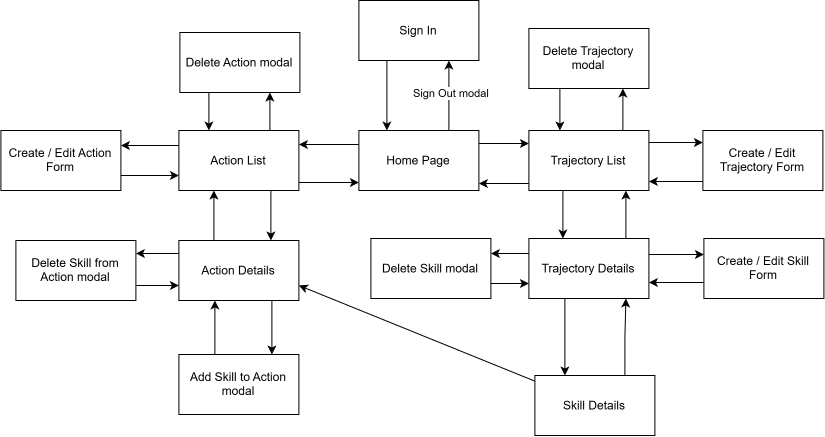

# User Interface Design
This section contains the user interface design artifacts for the Skills Map application, including wireframes, navigation, and traceability to functional requirements.
## Design Goals
The interface is designed to support personal management of learning trajectories, skills, and actions.
The main UI goals are:
- provide intuitive navigation between main entities;
- support creating and managing learning trajectories;
- support searching and filtering of skills and actions;
- make relationships between skills and actions easy to understand.

## Wireframes
Wireframes describe the main application screens and user interactions. The following screens are included:
### Authentication and Home Page
- [Sign In Form](./wireframes/Sign-In-Form.pdf)
- [Home Page](./wireframes/Home-Page.pdf)
- [Sign Out Confirmation Modal](./wireframes/Sign-Out-Confirmation-Modal.pdf)
### Trajectories and Skills Management
- [Trajectory List](./wireframes/Trajectory-List.pdf)
- [Create and Edit Trajectory Form](./wireframes/Create-and-Edit-Trajectory-Form.pdf)
  > Create forms contain empty fields; edit forms contain prefilled fields.
- [Trajectory Details](./wireframes/Trajectory-Details.pdf)
- [Delete Confirmation Modal Example](./wireframes/Delete-Confirmation-Modal-Example.pdf)
  > The same modal is reused for deleting trajectories, skills, and actions.
- [Create and Edit Skill Form](./wireframes/Create-and-Edit-Skill-Form.pdf)
- [Skill Details](./wireframes/Skill-Details.pdf)
### Actions Management
- [Action List](./wireframes/Action-List.pdf)
- [Create and Edit Action Form](./wireframes/Create-and-Edit-Action-Form.pdf)
- [Action Details](./wireframes/Action-Details.pdf)
- [Add Skill to Action Modal](./wireframes/Add-Skill-to-Action.pdf)

## Navigation Map
The navigation map shows navigation between application screens, dialogs, and user interactions.  

## Traceability
The table below shows the relationship between functional requirements and the corresponding user interface screens.

| User Story | Related UI |
|------------|------------|
| US01 Create Trajectory | Trajectory Create Screen |
| US04 Manage Skill | Skill List, Skill Details, Skill Edit |
| US05 Add Action and Resource | Action Create Screen |
| US06 View Skill Actions | Skill Details Screen |
